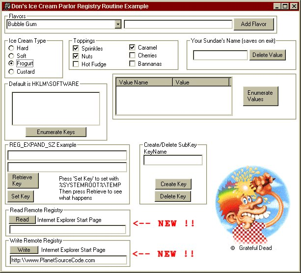



## A\_\_\_Ultimate Registry Class

### Description

Read AND Write to REG_DWORD, REG_SZ, REG_BINARY, REG_EXPAND_SZ, REG_MULTI_SZ

Enumerate Registry Keys (Example to Listbox)

Enumerate Registry Values (Example to Listview)

Delete Key Values

Delete Keys

Create Registry Keys

Expand REG_EXPAND_SZ to environment variable

** Update 11/6/01 **

* Read/Write to Remote Machine's Registry !!

* Bug Fix Added Error extra error code check in Read routines

* Changed Name of project to put higher in list

It's a somewhat Shady thing, but I believe that

my code is the most complete out there.

Included sample application shows how to use each function. Code is fully commented and easy to use.

Vote if you like.
 
### More Info
 
See function comments for individual input parameters.

I believe this to be the first example that puts everything together into one neat package and shows you how to use it.

See function comments for output and type

Euphoria,Giddiness, that its finally in one package and you can now read and write those pesky REG_EXPAND_SZ AND REG_MULTI_SZ data types

             |
---                |---
**Submitted On**   |2002-09-05 10:36:32
**By**             |[Dki](https://github.com/Planet-Source-Code/PSCIndex/blob/master/ByAuthor/dki.md)
**Level**          |Advanced
**User Rating**    |4.9 (221 globes from 45 users)
**Compatibility**  |VB 6\.0
**Category**       |[Registry](https://github.com/Planet-Source-Code/PSCIndex/blob/master/ByCategory/registry__1-36.md)
**World**          |[Visual Basic](https://github.com/Planet-Source-Code/PSCIndex/blob/master/ByWorld/visual-basic.md)
**Archive File**   |[A\_\_\_Ultima127101952002\.zip](https://github.com/Planet-Source-Code/dki-a-ultimate-registry-class__1-28518/archive/master.zip)

